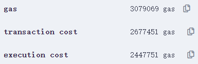
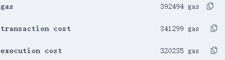
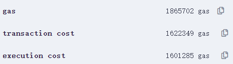
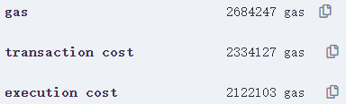
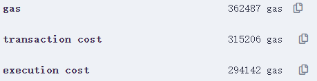
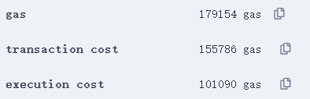

Full codes and the dataset will be published as long as the paper *Privacy-preserving Blockchain-enabled Parametric Insurance via Remote Sensing and IoT* is published.

## Running tips

Prover (main part is set up by Haskell and followed by Python, Elliptic Curve Digital Signature (ECDSA) is generated by Go) generated data has to be copied from output file to verifier code.

For verifier, please notice that current code may be temporary code for cost estimation, and right version is annotated.

Feasibility-check code is in ./src/RSP, and the dataset used is the ./data folder.

### Running Sonic Proof Generation
1. set up the repoitory. key packages:
    - pip install galois
    - pip install py_ecc
    - numpy, scipy, sklearn
    - haskell stack project builder
    
2. Run experiment-dt.py
    - setup decision tree parameters in the "setup_data" function before running the script.
    - stop the script once constraints are generated (i.e. once you see "constraints generation completed", interrupt the script).
    
3. Setup haskell scripts
    - in examples/Main.hs line 125, set inputSize = abc length
    - run "stack build"
    - run "stack exec sonic-example"
    
4. Rerun experiment-dt.py
    - if the script returns true, done!

## Data source

Digital Earth Australia is a project powered by Geoscience Australia. It is a digital platform based on open-sourced geospatial-data management platform Open Data Cube (ODC). The platform features a large collection of Earth observation data from Australia and a Python API for data access. Particularly, the platform provides surface reflectance imagery retrieved from Sentinel-2 ground observation satellites. The satellites provide high spatial resolution (up to 10 m) with 13 spectral bands, including NIR and SWIR. More specifically, we use the Sentinel-2B MSI Definitive ARD product, which contains high-quality surface reflectance data retrieved from Sentinel-2B satellite since 2017, with near-weekly sample frequency.

## Cost estimation

Deployment for sonic verifier:

Deployment for Enhanced verifier:

Enhanced verification:

Sonic verification:

If we assume that Necessary SRS elements are not stored on chain during deployment, but obtained from trusted third-party during verification, then:

Deployment for Enhanced+ verifier:

Enhanced+ verification:

If we apply a general Master contract and deploy slave contract for each insuree, then Deployment for Slave Contract:

We can estimate the transaction fee regarding [ETH price by the end of 2022 (ETH/USD = 1199.11)](https://ycharts.com/indicators/ethereum_price) and average gas price = 20 gwei.

| Transaction                                  | Gas Cost | Estimated USD |
| -------------------------------------------- | -------- | ------------- |
| Contract Deployment (Sonic)                  | 2667196  | 63.96523      |
| Sonic Verification                           | 1622349  | 38.9075       |
| Contract Deployment (Enhanced Verifier)      | 2677451  | 64.21117      |
| Enhanced Verification                        | 341299   | 8.185101      |
| Contract Deployment (Enhanced+ Verifier)     | 2334127  | 55.9775       |
| Enhanced+ Verification                       | 315206   | 7.559333      |
| Subcontract Deployment (Enhanced Verifier) * | 155786   | 3.736091      |

\* If we apply Fiat-Shamir heuristic, then gas cost of Subcontract Deployment can be further reduced to 111434.

