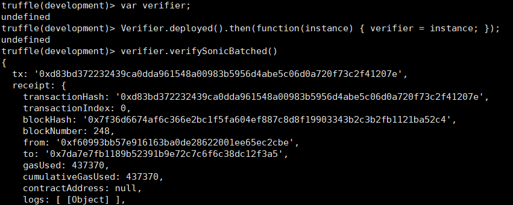

## Running tips

Prover (main part is set up by Haskell and followed by Python, Elliptic Curve Digital Signature (ECDSA) is generated by Go) generated data has to be copied from output file to verifier code.

For verifier, please notice that current code may be temporary code for cost estimation, and right version is annotated.

Feasibility-check code is in ./src/RSP, and the dataset used is the ./data folder.

## Data source

Digital Earth Australia is a project powered by Geoscience Australia. It is a digital platform based on open-sourced geospatial-data management platform Open Data Cube (ODC). The platform features a large collection of Earth observation data from Australia and a Python API for data access. Particularly, the platform provides surface reflectance imagery retrieved from Sentinel-2 ground observation satellites. The satellites provide high spatial resolution (up to 10 m) with 13 spectral bands, including NIR and SWIR. More specifically, we use the Sentinel-2B MSI Definitive ARD product, which contains high-quality surface reflectance data retrieved from Sentinel-2B satellite since 2017, with near-weekly sample frequency.

## Cost estimation

Deployment for sonic verifier:

Deployment for batched verifier:

Batched verification:

Unbatched verification:

We can estimate the transaction fee regarding [ETH price by the end of 2022 (ETH/USD = 1199.11)](https://ycharts.com/indicators/ethereum_price) and average gas price = 20 gwei.

| Transaction                                  | Gas Cost | Estimated USD  |
| -------------------------------------------- | -------- | -------------- |
| Contract Deployment                          | 3115256  | 74.7106924432  |
| Contract Deployment (using batched verifier) | 2805490  | 67.281822278   |
| Batched Verification                         | 437370   | 10.489094814   |
| Original Verification                        | 1740170  | 41.733104974   |
| Batched Contract & Verification              | 3242860  | 77.770917092   |
| Original Contract & Verification             | 4855426  | 116.4437974172 |

