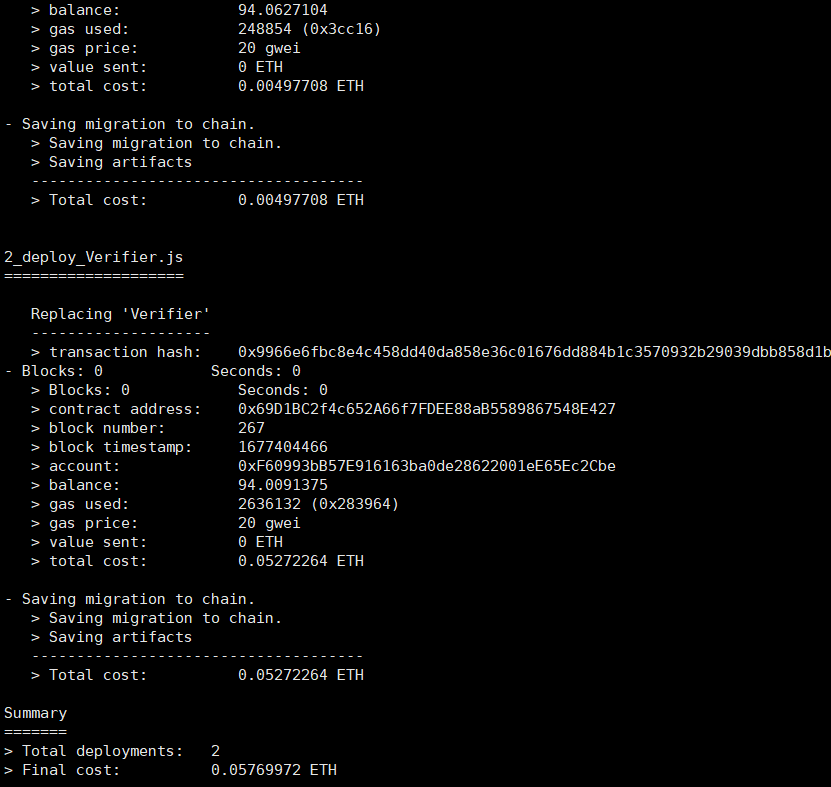
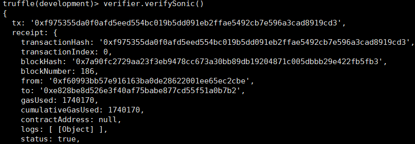

## Running tips

Prover generated data has to be copied from output file to verifier code.

For verifier, please notice that current code may be temporary code for cost estimation, and right version is annotated.

## Data source

## 

Digital Earth Australia is a project powered by Geoscience Australia. It is a digital platform based on open-sourced geospatial-data management platform Open Data Cube (ODC). The platform features a large collection of Earth observation data from Australia and a Python API for data access. Particularly, the platform provides surface reflectance imagery retrieved from Sentinel-2 ground observation satellites. The satellites provide high spatial resolution (up to 10 m) with 13 spectral bands, including NIR and SWIR. More specifically, we use the Sentinel-2B MSI Definitive ARD product, which contains high-quality surface reflectance data retrieved from Sentinel-2B satellite since 2017, with near-weekly sample frequency.

## Cost estimation

Deployment:

Deployment for batched verifier:

Batched verification:

Unbatched verification:

We can estimate the transaction fee regarding US Dollars using 2023-02-23's data (ETH/USD = 1666) and average gas price = 20 gwei.

| Transaction                                  | Gas Cost | Estimated USD |
| -------------------------------------------- | -------- | ------------- |
| Contract Deployment                          | 4949198  | 164.90727736  |
| Contract Deployment (using batched verifier) | 3754329  | 125.09424228  |
| Batched Verification                         | 452269   | 15.06960308   |
| Original Verification                        | 1740170  | 57.9824644    |

